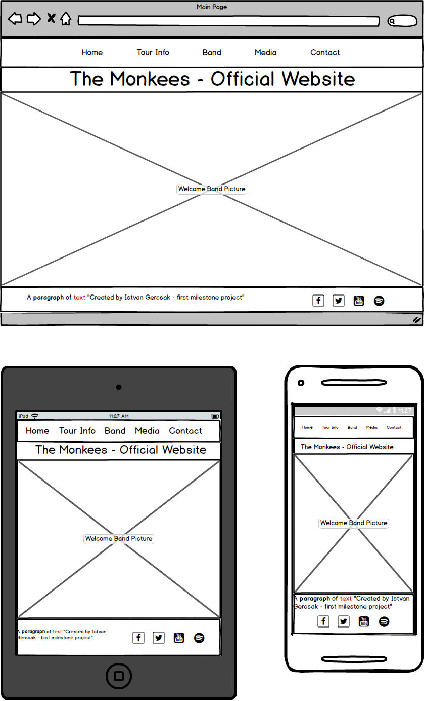

# The Monkees - Official Website

## About the Project:

This website made as my first Milestone project at [Code Institute](https://codeinstitute.net/). 
The main goal was to create a responsive, user centric frontend website using the HTML5 and CSS3 technology.
On the website the user can navigate between the pages easily and they can use the website on every device as well thanks 
for the responsive design and implementation.

- Throughout this project I had to create a website for a band called The Monkees. As the website is a static (front-end only) website
we have opportunity:
    - Check the website on every device easily
    - Navigate between the pages
    - Get information about their tour:
        - Where will be the next concerts 
        - When will be the next concerts 
        - How many ticket are available 
    - Find information about the band members
    - Listen some sample song and watch video clips from the band
    - Send request for the band if We would like to invite them for our private party
    - Check the band's social sites
 
## Mockups

**Created with [Balsamiq Mockups 3](https://balsamiq.com/) that is a user interface design tool**

- **Home page**:

- **Tour Info page**:

[Tour Info](Mockups/tourinfo.png)

- **Band page**:

[Band page](Mockups/band.png)

- **Media page**:

[Media page](Mockups/media.png)

- **Contact page**:

[Contact page](Mockups/contact.png)

## User Stories

### Navigation:

- As a user, I want to use the navigation bar so that I can reach every site.
- As a user, I want to use the "go back" and "go forward" browser button without any error so that I can go back and forward between the pages more easily.

### Social links:

- As a user, I want click on the social links so that it can be open in a new tab.

### Responsive:

- As a user, I want to use the website with every resolution so that on different devices it will work with the same functionality.

### Effects:

- As a user I want to see the hover effect on the buttons so that I can see there is interaction wih that element.
- As a user I want to see the hover effect on the social link so that I can see there is interaction wih that element.
- As a user I want to see the hover effect on the rows on the tour info page so that I can see which row I selected.

- As a user I want to see the "Buzz" effect on the navigation row on every page so that I get feedback about the navigation option.

### Media:

- As a user I want to play and stop the songs so that I can listen the songs.
- As a user I want to play and stop the video clip so that I can watch the video clip.

### Field checking:

- As a user I want to fill my details on the Contact page so that I can send the request. 
- As a user I want to get notified if I missed to fill a field so that I can finish to fill the form.
- As a user I want to get notified if I filled a field in a wrong way so that I can finish to fill the form.

## UX
 
- The Website is very colorful because these vivid colours connects to the band image. I use those kinds of colors that 
are simple and dominant in the Band life and in those years when they were young in the 70's. 
- The two dominant font family is "Special Elite" and "ZCOOL KuaiLe" which are google fonts. I imported those fonts through 
the .css style file from the google fonts repository.
- I used the "font awesome" font and icon toolkit for the social link icons.
- Hover effects on those elements where there is interaction
    - Navigation
    - Buttons
        - Buy tickets
        - Send request
    - Social links
- Favicon (Shortcut icon) with "M" sign on every page.

## Features 

Because of the technology restriction(HTML5 and CSS3) you can only navigate between the pages and 
you can reach the outer social sites. The main feature for this project is the responsive design and implementation 
furthermore the user centric development.
 
### Existing Features

- Social links
    - You can reach the social sites on new page from every page:
        - Facebook
        - Twitter
        - YouTube
        - Spotify  
- Buy tickets
    - Inactive "Buy ticket" button if the ticket are sold
- Send Request
    - Required fields, restricted format when you fill the form and you want to send it
- Hover effects:
    - On the navigation elements
    - On the buttons
    - On the social links
    - On the tour info rows 
- Responsive:
    - Every page are responsive, usable and looks good on the below resolution:
        - Phones less than 768px
        - Tablets 768px and Up
        - Desktops 992ox and Up
        - Large desktops 1200px and Up

### Features Left to Implement

- The "Buy Ticket" and "Send Request" functions need to have Javascript and jQuery technology.

## Used Technologies

- [HTML5](https://www.w3.org/html/)
    - Hypertext Markup Language is the standard markup language for creating web pages and web applications.
- [CSS3](https://www.w3.org/Style/CSS/)
    - Cascading Style Sheets is a style sheet language used for describing the presentation of a document written in a 
    markup language like HTML.
- [BootStrap 3.3.7](https://getbootstrap.com/docs/3.3/)
    - Front End Framework for developing responsive websites.
- [Git](https://git-scm.com/)
    - Git is a distributed version-control system for tracking changes in source code during software development.
- [GitHub](https://github.com/)
    -  GitHub Inc. is a web-based hosting service for version control using Git.

## Testing

Thanks to the "GitHub Pages" option on the GitHub website everybody can reach my website through the below link: 
https://istvangercsak.github.io/TheMonkees/

I prefer the GitHub Pages option instead of the Cloud9 because it is stable and available 24/7.

**Test types:**
- Manual tests
- Smoke tests on PC and Mobile
- Non-Functional tests (usability, reliability)

**Test cases for the user stories:**
- Navigation (Navigation links)
    - I am on the <on_page> page and I click on the <to_page> link. <loaded_page> page will be loaded.

| **on_page**   | **to_page**   | **loaded_page** |
|:-------------:|:-------------:|:---------------:|
| Home          | Home          | Home            |
| Home          | Tour Info     | Tour Info       |
| Home          | Band          | Band            |
| Home          | Media         | Media           |
| Home          | Contact       | Contact         |
| Tour Info     | Tour Info     | Tour Info       |
| Tour Info     | Home          | Home            |
| Tour Info     | Band          | Band            |
| Tour Info     | Media         | Media           |
| Tour Info     | Contact       | Contact         |
| Band          | Band          | Band            |
| Band          | Home          | Home            |
| Band          | Tour Info     | Tour Info       |
| Band          | Media         | Media           |
| Band          | Contact       | Contact         |
| Media         | Media         | Media           |
| Media         | Home          | Home            |
| Media         | Band          | Band            |
| Media         | Tour Info     | Tour Info       |
| Media         | Contact       | Contact         |
| Contact       | Contact       | Contact         |
| Contact       | Home          | Home            |
| Contact       | Band          | Band            |
| Contact       | Tour Info     | Tour Info       |
| Contact       | Media         | Media           |
| Contact       | Contact       | Contact         |

- Navigation ("Go back" and "Go forward" browser button)
    - I am on the <on_page> page and I click on the <to_page> link. I click on the "go back" browser button and the <go_to_page> page will be loaded without any error. 
    After this I click on the "go forward" browser button and the <to_page> page will be loaded without any error. 

| **on_page**   | **to_page**   | **go_to_page** |
|:-------------:|:-------------:|:--------------:|
| Home          | Tour Info     | Home           |
| Home          | Band          | Home           |
| Home          | Media         | Home           |
| Home          | Contact       | Home           |
| Tour info     | Home          | Tour info      |
| Tour info     | Band          | Tour info      |
| Tour info     | Media         | Tour info      |
| Tour info     | Contact       | Tour info      |
| Band          | Home          | Band           |
| Band          | Tour Info     | Band           |
| Band          | Media         | Band           |
| Band          | Contact       | Band           |
| Media         | Home          | Media          |
| Media         | Tour Info     | Media          |
| Media         | Band          | Media          |
| Media         | Contact       | Media          |
| Contact       | Home          | Contact        |
| Contact       | Tour Info     | Contact        |
| Contact       | Band          | Contact        |
| Contact       | Media         | Contact        |

- Social link
    - I click on the <social_link> social link and the band's <social_link> page will open in a new tab.
    
|social_link|
|:---------:|
|Facebook|
|Twitter|
|YouTube|
|Spotify|

- Responsive
    - I grab the edge of the browser and modify the resulution. After this the website is still usanle and looks good.
    - Chrome developer tools: details below at the **Chrome Developer Tool** section
    
- Effects
    - I hover my mouse on the <navigation_link> navigation link, and the buzz effect appears
    - I hover my mouse on the <social link> social link and I can see the transition effect
    - I hover on the active <button> button and I see the button hover effect 
    - I hover on the inactive "Buy ticket" button and I see the inactive hover effect
    
|navigation_link|social link|button|
|:-------------:|:---------:|:----:|
|Home|Facebook|Send Request|
|Tour Info|Twitter|Buy ticket|
|Band|Youtube||
|Media|Twitter||
|Contact||
    
- Media
    - I click on "play" button one of the music and it starts to play the music.
    - While the music is playing I clock on the stop button and the music is stops.
    - I click on the video player and the video starts to play.
    - While the video is playing I click on the stop button and the video is stops.
    
- Field checking
    - I fill the required fields and after clicking the "Send request" button, I can send my message. (At the moment the sending function is not working. Instead of that the page will reloaded)
    - I fill the e-mail field without e-mail format and I get feedback about the wrong format
    - I miss the <field> field and I get a notification that I missed to fill that field

|field       | 
|:----------:|
|Name        |
|E-mail      |
|Phone number|  
|Details     |

**Tested browsers:**
 - Chrome
 - Mozilla Firefox
 - Microsoft Edge

**Testing Tools:**
 - Chrome browser built-in developer tool
 - PC with HD resolution (with real usage)
 - Mobile Phones: 
    - Iphone SE
    - OnePlus 6T

**Chrome Developer Tool:**
- With the "Responsive" option I made boundary testing on the edges where the resolution changed from:
    - Large desktop to desktop (Tested pixel width values: 1201px, 1200px, 1199px)
    - Desktop to tablet (Tested pixel width values: 993px, 992px, 991px)
    - Tablet to phone (Tested pixel width values: 769px, 768px, 767px)
- Phone and Tablet resolution
    - Usage on the different device resolutions like "Pixel 2" and "iPad"
- Console log error checking on every page during the testing
 
**Testing people:**
- Acquaintance
- Friends
- Myself

## Deployment

- **Set up**:
    - As my first step and as I use local IDE for create the project, I installed the Git locally and synchronized my local IDE 
    with the local git. I use IntelliJ Pycharm for the front end development with its helpful built in deployment tools. 
    After I created a Git and GitHub repository, I could start to work.
- **Commits**:
    - After every small piece and increment, I made commit to my local Git repository. After that on the end of the 
    bigger section that gives value to my project I pushed my modification to my GitHub repository.

## Content

#### The text for the Band members was copied from:

- About Peter Tork:
    - [Wikipedia article](https://en.wikipedia.org/wiki/Peter_Tork)
- About Micky Dolenz:
    - [Wikipedia article](https://en.wikipedia.org/wiki/Micky_Dolenz)
- About Michael Nesmith:
    - [Wikipedia article](https://en.wikipedia.org/wiki/Michael_Nesmith)
-  About Davy Jones:
    - [Wikipedia article](https://en.wikipedia.org/wiki/Davy_Jones_(musician))
- Favicon:
    - [Official The Monkees Website](https://www.monkees.com/sites/default/files/favicon_1.ico)

#### Media
- The photos, the music and video used in this site were obtained from the Code Institute repository: 
    - [Code Institute GitHub repo](https://github.com/Code-Institute-Org/project-assets)