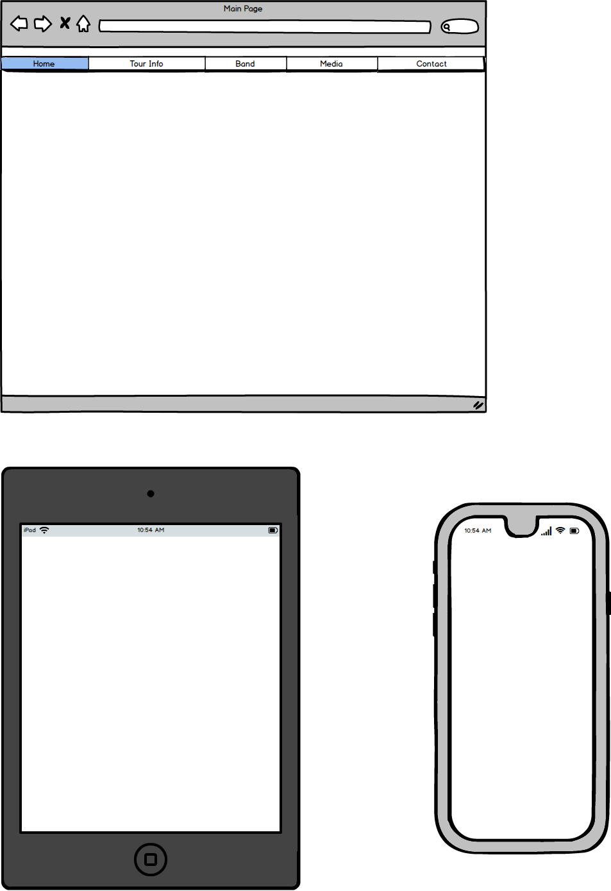

# The Monkees - Official Website

This site made as my first Milestone project at Code Institue. The main goal was to create a responsive, user centric frontend website using the HTML5 and CSS3 technology.
On the website the user can navigate between the pages easily and they can use the website on every device as well thanks for the responsive design and implementation.

On the page we can find information about the band members about the tour(where, when and how many ticket is available). We can listen some sample song and watch video clips on the Media site. We can send request for the band if We would like to invite them for a party. 
 
## Mockups

- Home page:

- Tour Info page:

- Band page:

- Media page:

- Contact page:

## User Stories

## UX
 
- This website prepared for the fans of the Band and also those people who would like to get familiar with the Band music and schedule.
- The Website is very colorful I use those kinds of colors that are simple and dominant in the Band life and those years where they were young in the 70's. 
- I used the font awesome for the social link icons.
- The two dominant font family is "Special Elite" and "ZCOOL KuaiLe". I imported those through the .css style file.
- 

## Features 

Because of the technology restriction(HTML and CSS) you only can navigate between the pages and you can reach the outer social sites.
 
### Existing Features
- Social outer links
    - You can reach the social sites on new page from every page
        - Facebook
        - Twitter
        - YouTube
        - Spotify  
- Buy tickets
    - Inactive "Buy ticket" button if the ticket are sold
- Send Request
    - Required fields, restricted format when you fills and you want to send it 
- Responsivity
    - Every page are responsive and looks good on the below resolution
        - Phones Less than 768px
        - Tablets 768px and Up
        - Desktops 992ox and Up
        - Large Desktops 1200px and Up

### Features Left to Implement
- The "Buy Ticket" and "Send Request" function need Javascript and jQuery technology.
- Moving progressbar - For this I should use Javascript

## Technologies Used

- [HTML5](https://www.w3.org/html/)
    - Hypertext Markup Language is the standard markup language for creating web pages and web applications
- [CSS3](https://www.w3.org/Style/CSS/)
    - Cascading Style Sheets is a style sheet language used for describing the presentation of a document written in a markup language like HTML
- [BootStrap 3.3.7](https://getbootstrap.com/docs/3.3/)
    - Front End Framework for developing responsive websites 

## Testing (Expand: How I test it, Responsive, Dev Tools, No console error)

Thanks to the GitHub Pages option everybody can reach my website through the below link: 
https://istvangercsak.github.io/TheMonkees/

I prefer the GitHub Pages option instead of the Cloud9 because it is up and available 24/7.

Browsers:
 - Chrome
 - Mozilla Firefox
 - Microsoft Edge
 
Testing Tools:
 - PC with HD resolution and responsiveness
 - Mobile Phone: 
    - Iphone SE
    - OnePlus 6T
    
Testing people:
- Acquaintance, Friends
- Smoke tests on PC and Mobile

## Deployment (How I start to deploy, what was the content of every increment and commit)

I use local IDE for create the project called PyCharm. There is a built in deployment tools so after I created a GitHub repository.

After every small piece I made commit to my local Git repository. After that on the end of the bigger section or the end of the day I pushed my modification to my GitHub repository. 

### Content
##### The text for the Band members was copied from:
- About Peter Tork:
    - [Wikipedia article](https://en.wikipedia.org/wiki/Peter_Tork)
- About Micky Dolenz:
    - [Wikipedia article](https://en.wikipedia.org/wiki/Micky_Dolenz)
- About Michael Nesmith:
    - [Wikipedia article](https://en.wikipedia.org/wiki/Michael_Nesmith)
-  About Davy Jones:
    - [Wikipedia article](https://en.wikipedia.org/wiki/Davy_Jones_(musician))
- Favicon:
    [Official The Monkees Website](https://www.monkees.com/sites/default/files/favicon_1.ico)

### Media
- The photos and video used in this site were obtained from the Code Institute repository: 
    - [Code Institute GitHub repo](https://github.com/Code-Institute-Org/project-assets)