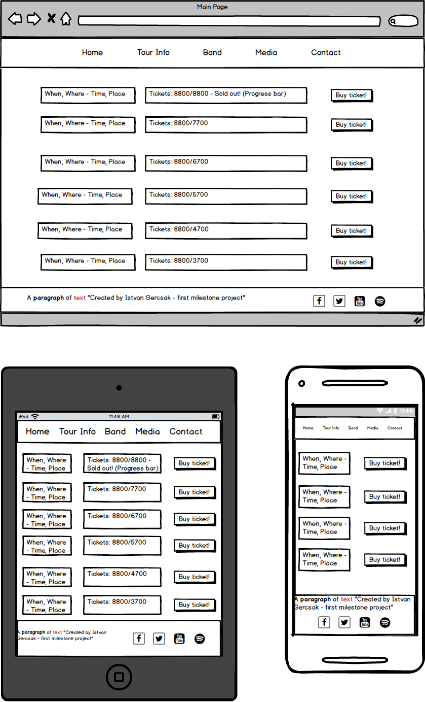
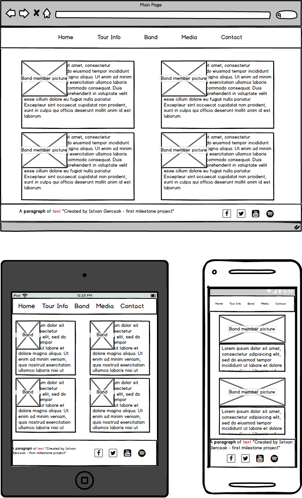
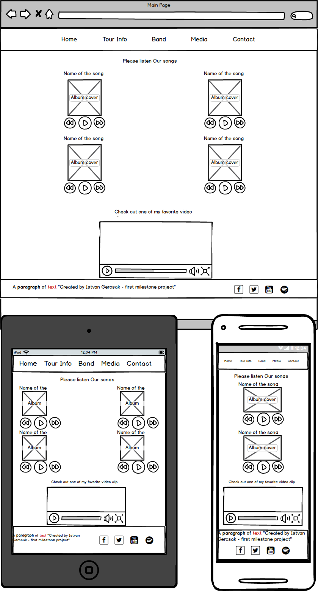
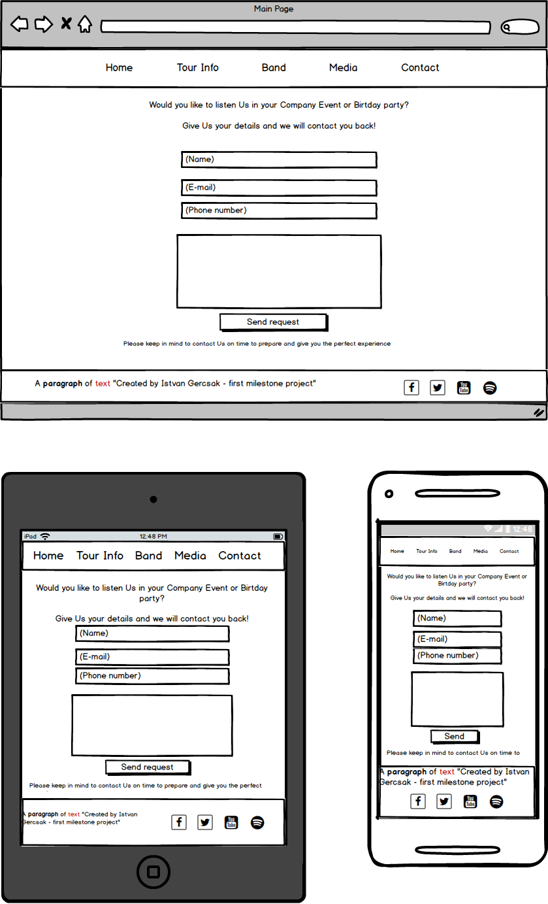

# The Monkees - Official Website

## About the Project:

This website made as my first Milestone project at Code Institue. The main goal was to create a responsive, user centric 
frontend website using the HTML5 and CSS3 technology.
On the website the user can navigate between the pages easily and they can use the website on every device as well thanks 
for the responsive design and implementation.

On the page we can find information about the band members, about the tour(where and when will be the next concerts. 
How many ticket is available). 
We can listen some sample song and watch video clips on the Media page. We can send request for the band if We would 
like to invite them for a party.
 
## Mockups

- **Home page**:

- **Tour Info page**:

- **Band page**:

- **Media page**:

- **Contact page**:

## User Stories

### Navigation:

As a user, I want to reach every page from every page with the usage of the navigation bar.

### Social links

As a user, I want to reach the social sites from every page in a new tab. 

### Responsive

As a user, I want to use the website on every device with every functionality

### Effects:

As a user I want to see the hover effect on the:
   - buttons (on the Tour info page and Contact page)
   - rows (on the Tour info page)
   - social links (on every page)

As a user I want to see the "Buzz" effect on the:    
- Menu items (on every page)

### Field checking

As a user I want to fill my details on the Contact page and get notify If I miss one of them

### Media

As a user I want to play and listen the song on the Media page.
As a user I want to play and listen the video clip on the Media page.

## UX
 
- This website prepared for the fans of the Band and also those people who would like to get familiar with the Band 
music and schedule.
- The Website is very colorful because these vivid colours connects to the band image. I use those kinds of colors that 
are simple and dominant in the Band life and those years where they were young in the 70's. 
- I used the "font awesome" font and icon toolkit for the social link icons.
- The two dominant font family is "Special Elite" and "ZCOOL KuaiLe" which are google fonts. I imported those fonts through 
the .css style file from the google fonts repository.
- Favicon (Shortcut icon) with "M" sign on every page.

## Features 

Because of the technology restriction(HTML and CSS) you only can navigate between the pages and 
you can reach the outer social sites. The main feature for this project is the responsive design and implementation 
furthermore the user centric development.
 
### Existing Features

- Social links
    - You can reach the social sites on new page from every page:
        - Facebook
        - Twitter
        - YouTube
        - Spotify  
- Buy tickets
    - Inactive "Buy ticket" button if the ticket are sold
- Send Request
    - Required fields, restricted format when you fills and you want to send it
- Hover effects on the buttons, on the social link and on the tour info rows 
- Responsive:
    - Every page are responsive, usable and looks good on the below resolution:
        - Phones less than 768px
        - Tablets 768px and Up
        - Desktops 992ox and Up
        - Large desktops 1200px and Up

### Features Left to Implement

- The "Buy Ticket" and "Send Request" functions need to have Javascript and jQuery technology.

## Used Technologies

- [HTML5](https://www.w3.org/html/)
    - Hypertext Markup Language is the standard markup language for creating web pages and web applications
- [CSS3](https://www.w3.org/Style/CSS/)
    - Cascading Style Sheets is a style sheet language used for describing the presentation of a document written in a 
    markup language like HTML
- [BootStrap 3.3.7](https://getbootstrap.com/docs/3.3/)
    - Front End Framework for developing responsive websites
- [Git](https://git-scm.com/)
    - Git is a distributed version-control system for tracking changes in source code during software development
- [GitHub](https://github.com/)
    -  GitHub Inc. is a web-based hosting service for version control using Git

## Testing

Thanks to the GitHub Pages option everybody can reach my website through the below link: 
https://istvangercsak.github.io/TheMonkees/

I prefer the GitHub Pages option instead of the Cloud9 because it is up and available 24/7.

Chrome Developer Tool:
- With the "Responsive" option I made boundary testing on the edges where the resolution changed from:
    - Large desktop to desktop (Tested pixel width values: 1201px, 1200px, 1199px)
    - Desktop to tablet (Tested pixel width values: 993px, 992px, 991px)
    - Tablet to phone (Tested pixel width values: 769px, 768px, 767px)
- Phone and Tablet resolution
    - Usage on the different device resolutions like "Pixel 2" and "iPad"
- Console log error checking on every page during the testing

Tested browsers:
 - Chrome
 - Mozilla Firefox
 - Microsoft Edge
 
Testing Tools:
 - Chrome browser built-in developer tool
 - PC with HD resolution (with real usage)
 - Mobile Phones: 
    - Iphone SE
    - OnePlus 6T
    
Testing people:
- Acquaintance
- Friends
- Myself

Test types:
- Manual tests
- Smoke tests on PC and Mobile
- Non-Functional tests (usability, reliability)

## Deployment

- **Set up**:
    - As my first step and as I use local IDE for create the project, I installed the Git locally and synchronized my local IDE 
    with the local git. I use Pycharm for the front end development and there is a helpful built in deployment tools. 
    After I created a Git and GitHub repository, I could start to work.
- **Commits**:
    - After every small piece and increment I made commit to my local Git repository. After that on the end of the 
    bigger section that gives value to my project I pushed my modification to my GitHub repository.

## Content

#### The text for the Band members was copied from:

- About Peter Tork:
    - [Wikipedia article](https://en.wikipedia.org/wiki/Peter_Tork)
- About Micky Dolenz:
    - [Wikipedia article](https://en.wikipedia.org/wiki/Micky_Dolenz)
- About Michael Nesmith:
    - [Wikipedia article](https://en.wikipedia.org/wiki/Michael_Nesmith)
-  About Davy Jones:
    - [Wikipedia article](https://en.wikipedia.org/wiki/Davy_Jones_(musician))
- Favicon:
    - [Official The Monkees Website](https://www.monkees.com/sites/default/files/favicon_1.ico)

#### Media
- The photos and video used in this site were obtained from the Code Institute repository: 
    - [Code Institute GitHub repo](https://github.com/Code-Institute-Org/project-assets)